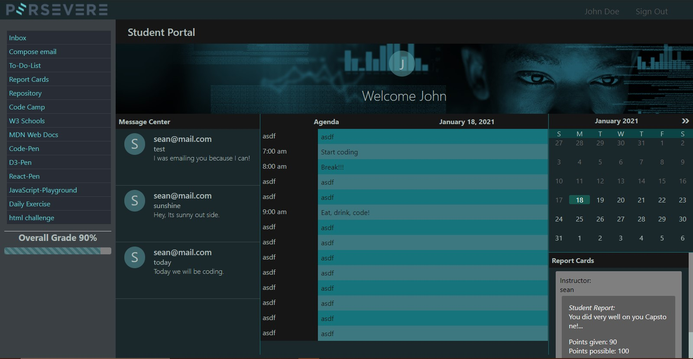
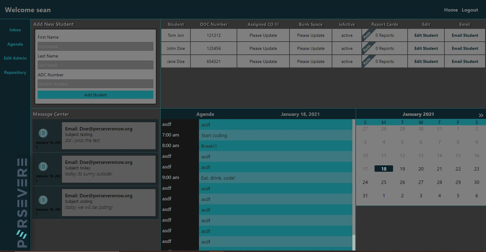

# Project Name: Persevere's Learning Management System


> Perseverenow.org Real Hope. Valuable Skills. Meaningful Opportunity

### Table of Contents

- [Description](#description)
- [How To Use](#how-to-use)
- [Reference](#references)
- [License](#license)
- [Author Info](#author-info)

---

## Description

Instructors and students alike will enjoy this time saving application. Communication to and from students is secure. All the learning tools for the students will help them in the toughest of learning environments.

### Persevere Student UI



### Persevere Instructor UI



---

#### Tecnologies

- HTML
- CSS
- JavaScript
- React
- SASS
- MariaDB
- MongoDB
- Express
- mongoose
- multer
- bcryptjs
- jsonwebtoken
- cors
- axios
- gridfs-stream
- react-toastify
- react-dom
- react-router-dom
- moment

---

## How To Use

### Installation

- Node Modules have to be installed in using `npm install`:

  - SQL_project (Main folder)
  - Client
  - ClientTwo
  - lms-mail-mongo-server

- From the root of the project, run `npm run dev` to start the following services
  - server
  - client (instructor UI)
  - client two (student UI)
- From the root of the project, run `npm run mailServer` to start the email messaging server
- Use Chrome

- Required Databases: MongoDB and MariaDB
- The MariaDB database needs to be seeded through HeidiSQL or the command line terminal with all the code from the database.sql file located in the main folder.

#### To update styles, apply the following SASS settings
- Run the sass complier by clicking the "Watch Sass" button on the bottom bar of VSC.
- Visual Studio Code SASS settings:

  ``` 
    "liveSassCompile.settings.formats":
      [
          {
              "format": "expanded",
              "extensionName": ".css",
              "savePath": "/clientTwo/src/assets/css"
          }

      ],

  ```

#### Instructor UI is on localhost:4043

- Instructors can register using the following password: perseverenow.org
- New students are register by the instructor using the add student feature in the Instructors UI
- Update and deletion of students are done by clicking the edit student button on the student list
- Email students by clicking the email button on the student list
- Report cards are created by clicking the rating banner button on the student list
- Click on the calendar the view that days agenda
- Create an agenda by following the Make Agenda link in the up left corner of the screen
- To view emails click the inbox link located on the left side of the screen

#### Student UI is on localhost:3000

- Students login using their DOC number as their name and password
- Click on the calendar the view that days agenda
- Click the emails or the inbox to view the emails
- Report cards are located on the bottom right corner
- links on the left lead to the following:
  - Compose email
  - Code Camp
  - W3 Schools
  - MDN
  - Code-Pen
  - D3-pen
  - React-Pen
  - JavaScript Playground
  - Daily Exercise
  - html challenge
- Overall grade is the average of all the report cards and is dispayed on the left part of the screen

---

#### API Reference

```javaScript
   module.exports = (req, res, next) => {
    const {email, password, emailRegister, name, passwordRegister } = req.body;

    const validEmail = (userEmail) => {
        return /^\w+([\.-]?\w+)*@\w+([\.-]?\w+)*(\.\w{2,3})+$/.test(userEmail);
    };

    if (req.path === '/register') {
        if (![emailRegister, name, passwordRegister].every(Boolean)) {
            return res.status(401).json('Missing Credentials');
        } else if (!validEmail(emailRegister)) {
            return res.status(401).json('Invalid Email');
        }
    } else if (req.path === '/') {
        if (![email, password].every(Boolean)) {
           return res.status(401).json('Missing Credentials');
        } else if (!validEmail(email)) {
            return res.status(401).json('Invalid Email');
        }
    }
    next();
};
```

[Back To The Top](#-Project-Name:-Perseveres'-Learning-Management-System)

---

## References

- Perseverenow.org
- Traversy Media
- MDN.org
- W3Schools.com

[Back To The Top](#-Project-Name:-Perseveres'-Learning-Management-System)

---

## License

MIT License

Copyright (c) [2020] [Persevere]

Permission is hereby granted, free of charge, to any person obtaining a copy of the software and associated documentation files (the "Software"), to deal in the Software without restriction, including without limitation the rights to use, copy, modify, merge, publish, distribute, sublicense, and/or sell copies of the Software, and to permit persons to whom the Sortware is furnished to do so, subject to the following conditions:

The above copyright notice and this permission notice shall be included in all copies or substantial portions of the Software.

THE SOFTWARE IS PROVIDED "AS IS", WITHOUT WARRANTY OF ANY KIND, EXPRESS OF IMPLIED, INCLUDING BUT NOT LIMTIED TO THE WARRANTIES OF MERCHANTABILITY, FITNESS FOR A PARTICULAR PURPOSE AND NONINFRIVGEMENT. IN NO EVENT SHALL THE LIABILITY, WHETHER IN AN ACTION OF CONTRACT , TORT OF OTHERWISE, ARISING FROM, OUT OF OR IN CONNECTION WITH THE SOFTWARE OR THE USE OR OTHER DEALINGS ING THE SOFTWARE.

[Back To The Top](#-Project-Name:-Perseveres'-Learning-Management-System)

---

## Author Info

### Created By:

### S. OBrien

### T. Mayes

### T. McQuade

### B. Hooker

### J. McLain

### K. Scelza

[Back To The Top](#-Project-Name:-Perseveres'-Learning-Management-System)
